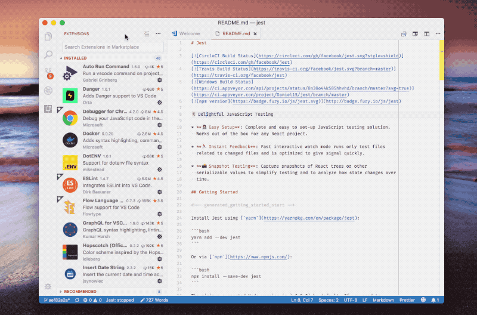

# Frequently Asked Questions

If you have a question that is not listed below, please <a href="mailto:wcandillon@gmail.com">contact us</a>.

## When buying React Native Elements, how will I be updated? And how can I report issues?

Once you acquire React Native Elements please <a href="mailto:wcandillon@gmail.com">send us your Github</a> username.
We will grant you access to the repository where the starter kit is develop and you will get notified for each update.
You will also be able to use the Github issues to ask questions and report potential issues.

## Extra errors when using Visual Studio Code

To develop React Native Elements with Visual Studio, we recommend adding a flow extension such as [this one](https://github.com/flowtype/flow-for-vscode). You also need to set `javascript.validate.enable` option to false or completely disable the built-in TypeScript extension for your project (see gif below):

